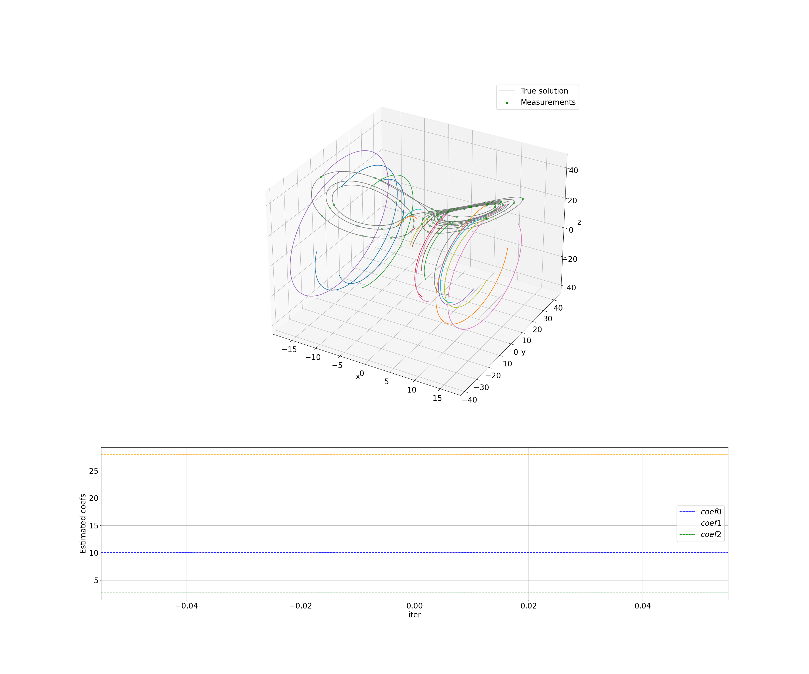

# GaussNewton: Parameter Identification for Nonlinear Systems using Gauss–Newton with Multiple Shooting and MHE

This project implements the **Gauss–Newton method** combined with **multiple shooting** for joint estimation of parameters and initial conditions of nonlinear dynamical systems from noisy measurements.  
Additionally, the code supports **Moving Horizon Estimation (MHE)** – a recursive, sliding‑window version of the method suitable for real‑time applications.

## Key Features

- Symbolic model definition (via CasADi) with automatic Jacobian generation.
- Integration of the extended system (states + sensitivity matrices with respect to parameters and initial conditions).
- **Multiple shooting** – splitting the time horizon into segments with continuity constraints.
- **Moving Horizon Estimation (MHE)** – sliding‑window processing with prior information (arrival cost) and covariance update.
- Two computation modes: **NumPy/SciPy** (debugging) and **JAX** (JIT‑compilation for speed).
- Synthetic data generator with configurable noise and initial condition perturbations.
- Comprehensive visualisation: phase trajectories (2D/3D), time series of all states, parameter convergence, residual plots (measurement and continuity).

To first run use command uv sync

Pytest run by command: 
1) uv run pytest test/gauss_newton_test.py -v
2) uv run pytest test/mhe_test.py -v

