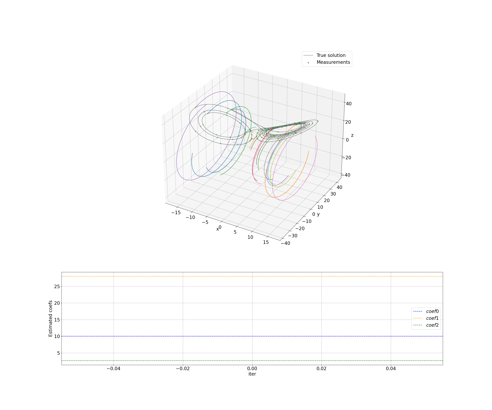

# GaussNewton — ODE parameter identification

[](https://github.com/IlyaChichkanov/GaussNewton/actions/workflows/ci.yml)

Estimation of the parameters θ of nonlinear dynamical systems from noisy
measurements: **Gauss–Newton with multiple shooting**, estimating θ and the
shot initial states jointly. Also included: **MHE** (sliding window, with a
recursive real-time variant) and **MPC** on acados.



## Features

- Symbolic models in CasADi; Jacobians are generated automatically.
- **Two sensitivity integrators:**
  - variational equations (`scipy solve_ivp` / `jax odeint`) — explicit methods
    for non-stiff systems;
  - orthogonal collocation on **Radau IIA** with exact derivatives of the
    discrete scheme (IND) — L-stable, applicable to stiff systems.
- **Two ways to assemble the step:** through a sparse J, or by accumulating
  H = ΣJᵢᵀJᵢ and g = ΣJᵢᵀrᵢ when the big J is not needed.
- **Adaptive regularization:** λ by gain ratio (Nielsen), μ from the curvature
  with Powell tightening — no manual tuning.
- Covariance of θ and confidence intervals from the KKT matrix, so continuity
  is treated as a constraint rather than as an observation.
- Several data batches sharing the parameters; a synthetic data generator.
- Plotly visualisation: 2D/3D phase trajectories, time series, parameter
  convergence with confidence intervals, measurement and continuity residuals.

## Install

```bash
uv sync                    # dependencies
bash tools/setup_repo.sh   # git filter that strips notebook output
```

`tools/setup_repo.sh` is required on a fresh clone: `.gitattributes` declares
the `nbstrip` filter, but the filter itself is a local git setting and is not
stored in the repository. Without it git will silently commit notebooks
together with their images and the embedded `plotly.js` (hundreds of kilobytes
per file).

## Quick start

```python
import numpy as np
from commom_utils.systems import LotkaVoltera
from commom_utils.ode_system import SyntheticDataGenerator
from gauss_newton.normal_equations import MultipleShootingAccum
from gauss_newton.adaptive import run_optimization_adaptive

system = LotkaVoltera()

# synthetic data
gen = SyntheticDataGenerator(system, sigma=0.01, use_jax=True)
t_batches, meas_batches, _, _ = gen.generate(
    c0=np.array([6.0, 5.0]), theta=np.array([1.2, 0.4, 0.3, 0.1]),
    time_intervals=[(0.0, 4.0)], n_measurements=200)

# the problem: 5 shots, unit measurement weights
problem = MultipleShootingAccum(system, N_shoot=5, gamma=np.ones(system.n_obs))
problem.add_batch(meas_batches[0], t_batches[0])

theta_full = problem.make_full_theta(np.array([1.0, 0.5, 0.2, 0.05]))
theta_opt, hist = run_optimization_adaptive(problem, theta_full, verbose=True)

print("theta:", theta_opt[:system.n_theta])
print("95% CI:", hist["ci_low"][-1], hist["ci_high"][-1])
```

For stiff systems only the problem class changes; the interface is the same:

```python
from gauss_newton.normal_equations import CollocationShootingAccum
problem = CollocationShootingAccum(system, N_shoot=5, gamma=np.ones(system.n_obs),
                                   K=3, n_sub=2)   # Radau IIA, 3 stages
```

### Your own models

Subclass `ODESystem` (`commom_utils/ode_system.py`) and define
`get_derivative`, plus `observation` and `get_input_signals` if needed:

```python
class MyModel(ODESystem):
    def __init__(self):
        super().__init__(nx=2, n_theta=3, nu=1)   # order: nx, n_theta, nu

    def get_derivative(self, state, theta, u):
        return ca.vertcat(...)                    # a CasADi expression

    def observation(self, state, theta, u):
        return ca.vertcat(state[0])               # what is actually measured

    def get_input_signals(self, t):
        return [jnp.sin(t)]                       # see the warning below
```

**`get_input_signals` is called inside the ODE right-hand side**, including
with a traced time under `jax odeint` and with an array of times in the
collocation path. So: `jnp` only, no Python `if t < ...` (use `jnp.where`) and
no `math.*`. Inputs that are discontinuous in time give an uncontrolled error
with the explicit adaptive integrator — see
[docs/pitfalls.md](docs/pitfalls.md).

## Tests

```bash
uv run pytest pytests/ -v         # everything (91 passed, 2 skipped)
uv run pytest pytests/jacobian_fd_test.py -v   # Jacobian vs finite differences
GN_TEST_PLOT=1 uv run pytest pytests/collocation_accum_test.py   # with figures
```

`pytests/mhe_test.py` and `pytests/mpc_test.py` are skipped when acados is not
installed. What each test guards is described in
[docs/testing.md](docs/testing.md).

## MHE and MPC

These need **acados**, which is built from source rather than installed from
PyPI:

```bash
git clone https://github.com/acados/acados.git && cd acados
git submodule update --init --recursive
mkdir build && cd build && cmake -DACADOS_WITH_QPOASES=ON .. && make install -j4
pip install -e ../interfaces/acados_template
export LD_LIBRARY_PATH=$LD_LIBRARY_PATH:<acados>/lib
export ACADOS_SOURCE_DIR=<acados>
```

## Documentation

| Page | What is in it |
|---|---|
| [docs/architecture.md](docs/architecture.md) | Layers, classes and how they call each other |
| [docs/api-reference.md](docs/api-reference.md) | Every public class and function |
| [docs/math.md](docs/math.md) | The method and the μ/λ schedules |
| [docs/notation.md](docs/notation.md) | Theory ↔ code symbol table |
| [docs/pitfalls.md](docs/pitfalls.md) | Non-obvious failure modes |
| [docs/testing.md](docs/testing.md) | What each test guards |
| [docs/performance.md](docs/performance.md) | Measured timings |
| [docs/style.md](docs/style.md) | Comment and docstring rules |

Derivations live in the theory notebooks at the repository root (in Russian):
`theory_gauss_newton.ipynb`, `collocation.ipynb`,
`adaptive_regularization.ipynb`, `theory_mhe.ipynb`.

## Repository layout

```
commom_utils/     model, sensitivities, collocation, example systems
gauss_newton/     problem assembly, normal equations, optimization, plotting
mhe/  mpc/        MHE and MPC on acados
experiments/
  sintetic_data/  runs on synthetic data
  real_data_cars/ runs on real vehicle data (Ceed, Voyah)
  datasets/       raw CSV and CAN logs — outside git, see datasets/README.md
  data_utils.py   LogReaderV2, theta_to_physical
pytests/          tests
tools/            nbstrip.py (git filter), setup_repo.sh
docs/             documentation
*.ipynb           theory notebooks
```

Notebooks under `experiments/` open with a bootstrap cell that walks up from
the current directory to `pyproject.toml`, puts the repository root on
`sys.path` and defines `DATASETS` (overridable with `GN_DATASETS`), so a
notebook works the same from Jupyter and from a runner started at the root.

## Known limitations

- **Time-discontinuous input signals.** The explicit adaptive integrator does
  not know about the kink, steps over it, and the sensitivities lose several
  digits on the interval containing it (recorded in
  `pytests/jacobian_fd_test.py::test_discontinuous_input_degrades_sensitivities`).
  Work around it by putting a shot boundary at the discontinuity, or use
  collocation.
- **Collocation runs at a fixed step**: accuracy is set by `n_sub` and there is
  no error estimate — check convergence by running `n_sub` and `2*n_sub`.
- `SyntheticDataGenerator` adds noise **to the states** before computing h(x)
  (process noise, not measurement noise); `MHESyntheticDataGenerator` adds it
  to the output.
- Bounds on θ exist only in MHE; the Gauss–Newton part has no parameter bounds.
